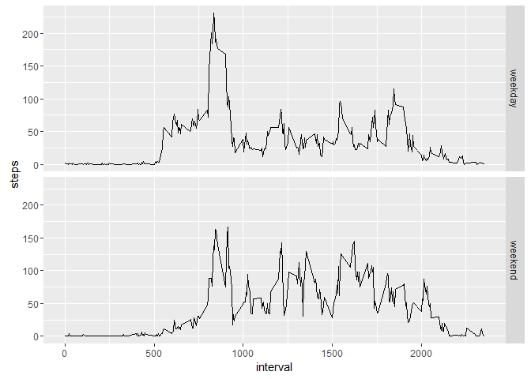

# Reproducible Research: Peer Assessment 1


## Loading and preprocessing the data

Loading data from activity.zip in working directory. 


```r
  data <- read.csv(unz("activity.zip", "activity.csv"))
```


## What is mean total number of steps taken per day?


```r
   steps.per.day <- aggregate(steps ~ date, data = data, sum)
   hist(steps.per.day$steps, xlab="Step range",breaks=30)
```

<!-- -->


```r
    summary <- c(mean.steps=mean(steps.per.day$steps), median.steps=median(steps.per.day$steps))
    summary
```

```
##   mean.steps median.steps 
##     10766.19     10765.00
```

## What is the average daily activity pattern?


```r
   average.steps.per.interval <- aggregate(steps ~ interval, data = data, mean)
   plot(average.steps.per.interval$interval, average.steps.per.interval$steps, type="l", 
        xlab="Interval", ylab="Average steps", main="Average steps by interval of day")
```

<!-- -->

The interval with the maximum average steps is:

```r
    average.steps.per.interval[which(average.steps.per.interval$steps == max(average.steps.per.interval$steps)),"interval"]
```

```
## [1] 835
```


## Imputing missing values

Total number of missing step values is:

```r
  sum(is.na(data$steps))
```

```
## [1] 2304
```

The following function will be used to fill in missing step values with the average of the interval. 

```r
  impute.steps <- function(data) {
      for (i in 1:nrow(data)) {
        if (is.na(data[i, "steps"])) {
          data[i, "steps"] = average.steps.per.interval[average.steps.per.interval$interval == data[i,]$interval,]$steps
        }          
      }
      data
  }
```
New imputed dataset:

```r
  data.imputed <- impute.steps(data)
```


```r
   steps.per.day <- aggregate(steps ~ date, data = data.imputed, sum)
   hist(steps.per.day$steps, xlab="Step range",breaks=30)
```

<!-- -->


```r
    summary <- c(mean.steps=mean(steps.per.day$steps), median.steps=median(steps.per.day$steps))
    summary
```

```
##   mean.steps median.steps 
##     10766.19     10766.19
```
Mean and median before and after imputing remain almost identical. The median approaches the mean as the mean was used for substitution of NA values. 

## Are there differences in activity patterns between weekdays and weekends?


```r
  data.imputed$day.of.week <- as.factor(weekdays(as.Date(data.imputed$date)))
  data.imputed$day.type <- as.factor(ifelse(
    data.imputed$day.of.week == "Saturday" | 
    data.imputed$day.of.week == "Sunday", 
    "weekend", "weekday"))
  
  av.steps <- aggregate(steps ~ interval + day.type, data = data.imputed, mean)

  library(ggplot2)
  p <- ggplot(av.steps, aes(interval, steps))
  p <- p + geom_line() + facet_grid(day.type ~ .)
  plot(p)
```

<!-- -->
